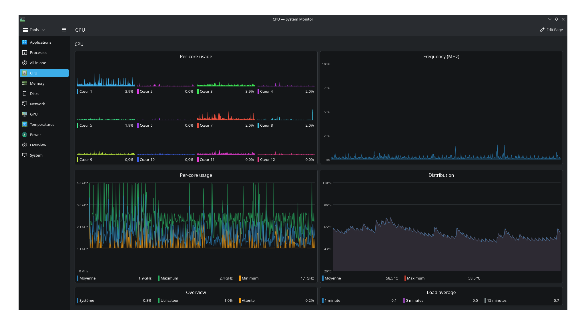
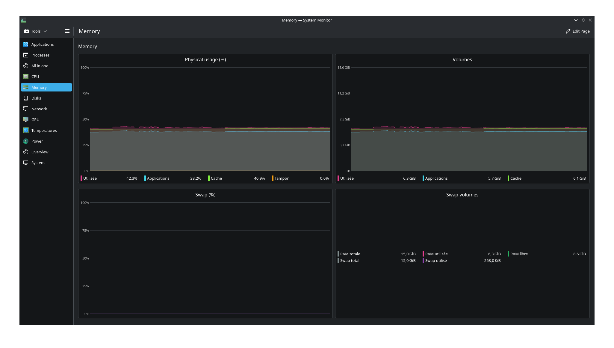
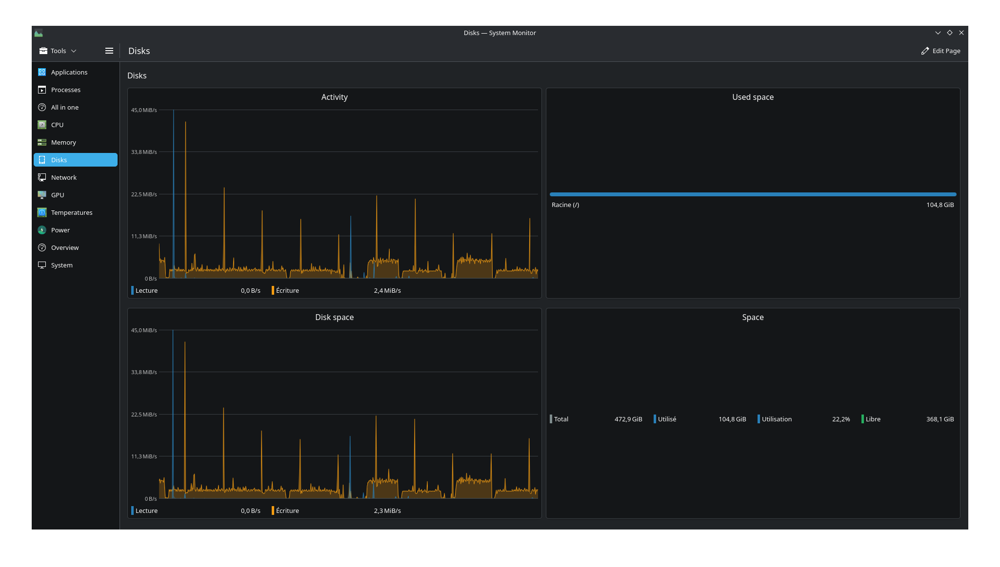
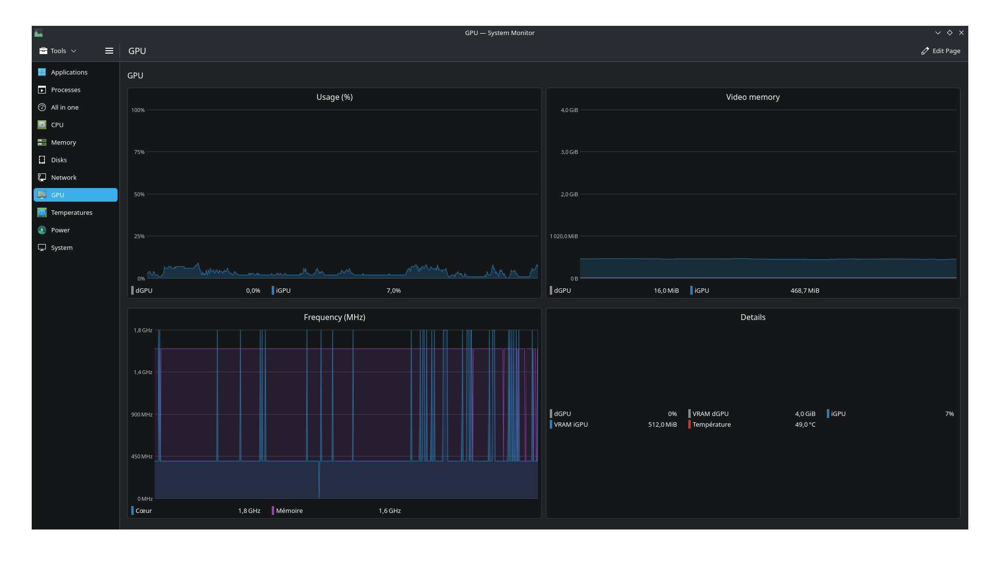
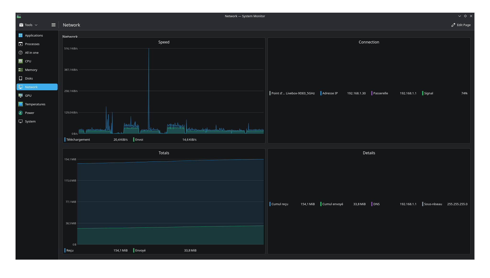
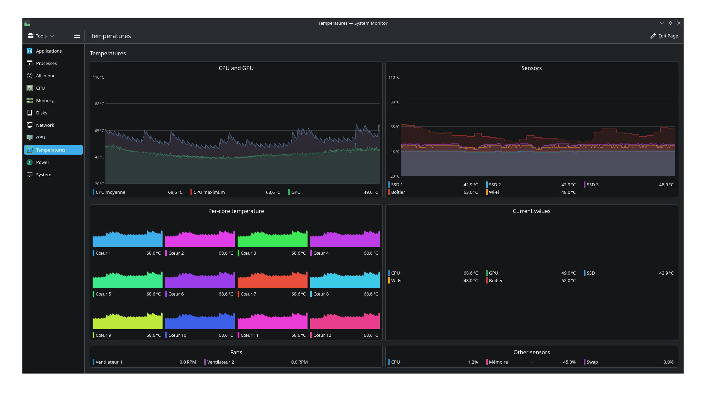
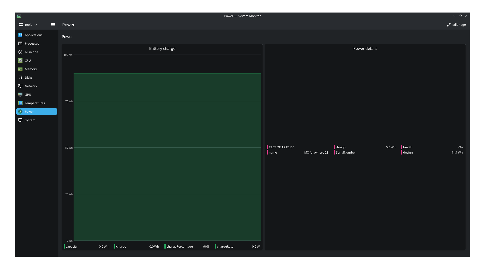
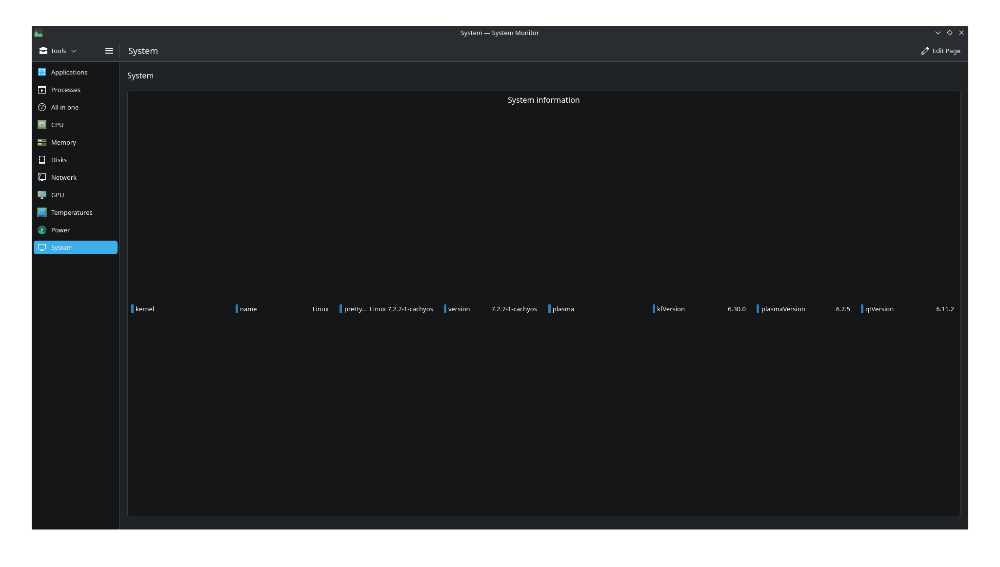

# awesome-kde-system-monitor

Custom pages for KDE Plasma System Monitor. Includes pre-generated `.page` files and a Python generator that auto-adapts to your system's sensors.

## Pages

| File | Description | Screenshot |
|------|-------------|------------|
| `CPU.page` | Per-core usage grid, total usage, frequency, temperature, breakdown, load average | [](screenshots/README.md#cpu) |
| `Memoire.page` | RAM usage %, physical volumes, swap usage | [](screenshots/README.md#memoire) |
| `Disques.page` | Disk I/O activity, per-disk usage bars, root disk, space summary | [](screenshots/README.md#disques) |
| `GPU.page` | dGPU/iGPU usage, VRAM, frequencies, temperature details | [](screenshots/README.md#gpu) |
| `Reseau.page` | Network speed, connection info, cumulative totals | [](screenshots/README.md#reseau) |
| `Temperatures.page` | CPU/GPU temps, lm-sensors, per-core temps, fans | [](screenshots/README.md#temperatures) |
| `Alimentation.page` | Battery charge, power supply details | [](screenshots/README.md#alimentation) |
| `Systeme.page` | OS info (hostname, uptime, kernel) | [](screenshots/README.md#systeme) |

## Installation

### Option 1: One-liner install (recommended)

```bash
curl -sSL https://raw.githubusercontent.com/YoannDev90/awesome-kde-system-monitor/master/install.sh | bash
```

To copy pages only (no CLI tool):

```bash
curl -sSL https://raw.githubusercontent.com/YoannDev90/awesome-kde-system-monitor/master/install.sh | bash -s -- --pages-only
```

### Option 2: AUR (Arch Linux)

```bash
yay -S awesome-kde-system-monitor
# or
paru -S awesome-kde-system-monitor
```

### Option 3: uv (manual)

Requires [uv](https://docs.astral.sh/uv/):

```bash
uv tool install "awesome-kde-system-monitor @ git+https://github.com/YoannDev90/awesome-kde-system-monitor"
```

This installs the `generate-pages` command globally. If PyGObject is missing, you'll get a clear error with install instructions for your distro.

### Option 4: Copy pre-generated pages

Copy the `.page` files into the Plasma System Monitor config directory:

```bash
cp *.page ~/.local/share/plasma-systemmonitor/
```

Then restart Plasma System Monitor or log out/in.

### System dependency

The generator requires **PyGObject** for D-Bus sensor discovery. It is not pip-installable and must be installed via your system package manager:

```bash
# Debian/Ubuntu
sudo apt install python3-gi gir1.2-glib

# Fedora
sudo dnf install python3-gobject glib2

# Arch
sudo pacman -S python-gobject glib2

# openSUSE
sudo zypper install python3-gobject
```

## Generator

The `generate_pages/` package auto-discovers your system's sensors via D-Bus (ksystemstats) and generates adapted `.page` files.

### Requirements

- Python 3.10+
- PyGObject (see [system dependency](#system-dependency) above)
- KDE Plasma 6 with ksystemstats running

### Usage

```bash
# List detected sensors
python3 -m generate_pages --list-sensors

# Generate pages (French labels, default)
python3 -m generate_pages

# Generate with English labels
python3 -m generate_pages -l en

# Generate to a specific directory
python3 -m generate_pages -o ./output

# Generate + validate
python3 -m generate_pages -v

# Show diff before overwriting
python3 -m generate_pages --diff

# Preview what would be generated
python3 -m generate_pages --preview

# Fetch live sensor values
python3 -m generate_pages --live

# Watch mode (regenerate every 30s)
python3 -m generate_pages --watch

# Show color palette
python3 -m generate_pages --show-colors
```

### Tasks (mise)

```bash
mise run gen        # Generate pages (French)
mise run gen-en     # Generate pages (English)
mise run validate   # Generate + validate
mise run check      # Lint + format + typecheck + tests
mise run test       # Run unit tests
mise run sensors    # List detected sensors
```

### Project Structure

```
generate_pages/
  __init__.py        # Package metadata
  __main__.py        # CLI entry point, validation
  blocks.py          # KConfig block generators (faces, layouts)
  constants.py       # Color palette, semantic colors, AIO face IDs
  kconfig.py         # Regex escaping helpers (kp, kk)
  sensors.py         # D-Bus sensor discovery and grouping
  palette.json       # 64-color palette (R, G, B)
  i18n/              # Internationalization
    __init__.py      # t() function, set_lang()
    fr.json          # French translations
    en.json          # English translations
  pages/
    __init__.py      # Generator registry
    cpu.py           # CPU page generator
    memory.py        # Memory page generator
    disks.py         # Disk page generator
    network.py       # Network page generator
    gpu.py           # GPU page generator
    temperatures.py  # Temperature page generator
    power.py         # Power page generator
    os.py            # OS page generator
```

## Internationalization (i18n)

All user-facing strings use translation keys. French is the default; English via `-l en`.

### Adding a language

1. Create `generate_pages/i18n/{lang}.json` (copy `fr.json` as template)
2. Add the language code to the `choices` list in `__main__.py`
3. Run `python3 -m generate_pages -l {lang}`

### Translation keys

Keys follow the pattern `category.specific_name`:

| Prefix | Scope | Example |
|--------|-------|---------|
| `page.*` | Page titles | `page.cpu` -> "Processeur" / "CPU" |
| `face.*` | Face/widget titles | `face.cpu.per_core` -> "Utilisation par coeur" |
| `sensor.*` | Sensor labels | `sensor.cpu.core` -> "Coeur" / "Core" |
| `ui.*` | UI elements | `ui.download` -> "Telechargement" |

Missing keys fall back to the key itself, so you can add new sensors without updating translations immediately.

## Customization

### Colors

Edit `generate_pages/palette.json` to change the 64-color palette. Colors cycle automatically for per-core and per-sensor views. Named semantic colors are defined in `constants.py`.

### Sensor Mapping

Each page generator in `generate_pages/pages/` maps sensor IDs to faces. Modify these files to add, remove, or reorder sensor displays.

### KConfig Format

`.page` files use KDE's KConfig INI format. Key escaping rules:
- `highPrioritySensorIds`: regex patterns need 4 backslashes (e.g., `cpu/cpu\\\\d+/usage`)
- `SensorColors`/`SensorLabels` keys: regex patterns need 2 backslashes (e.g., `cpu/cpu\\d+/usage`)

## Development

```bash
# Install dev dependencies
mise run install

# Run all checks (lint, format, typecheck, tests)
mise run check

# Run tests only
mise run test
```

## License

[MIT](LICENSE)
